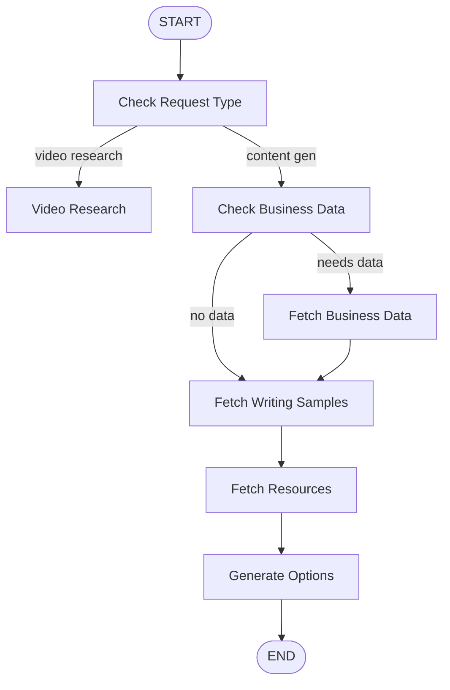

# Solution: LangGraph Implementation

Here's a production-ready LangGraph implementation that goes beyond the basic challenge. This solution demonstrates:
- Complex conditional routing
- State sharing across multiple nodes
- Parallel data fetching
- Real-world content generation workflow

---

## Architecture Overview

This solution implements a **content generation workflow** that:

1. Checks if the request needs business data
2. Fetches business context (if needed)
3. Retrieves writing samples from vector DB
4. Fetches relevant learning resources
5. Generates content options



---

## Complete Implementation

### 1. State Schema

```typescript
// app/workflows/content-generation-graph.ts
import { z } from 'zod';
import { StateGraph, START, END } from '@langchain/langgraph';
import { generateObject } from 'ai';
import { openai } from '@ai-sdk/openai';

// Define the state that flows through the graph
export const contentGenerationSchema = z.object({
  messages: z.array(
    z.object({
      role: z.enum(['user', 'assistant', 'system']),
      content: z.string(),
    })
  ),
  businessData: z.string().optional(),
  writingSamples: z.array(z.string()).optional(),
  sources: z.array(z.string()).optional(),
  relevantResources: z.array(
    z.object({
      title: z.string(),
      url: z.string(),
      category: z.string(),
      description: z.string(),
    })
  ).optional(),
  needsBusinessData: z.boolean().optional(),
  options: z.array(z.string()).optional(),
  isVideoResearch: z.boolean().optional(),
});

export type ContentGenerationState = z.infer<typeof contentGenerationSchema>;
```

### 2. Node Implementations

```typescript
import { generateEmbedding } from '@/libs/openai';
import { pinecone } from '@/libs/pinecone';
import * as fs from 'fs/promises';
import * as path from 'path';

// Node 1: Determine if business data is needed
const checkIfBusinessDataNeededNode = async (state: ContentGenerationState) => {
  const lastMessages = state.messages.slice(-5);

  const result = await generateObject({
    model: openai('gpt-4o-mini'),
    schema: z.object({ needsBusinessData: z.boolean() }),
    prompt: `
Determine if the user is asking for business advice or metrics.

Business advice examples:
- Questions about podcast performance
- Questions about audience/persona
- Business strategy or metrics

NOT business advice:
- General content requests
- Writing samples or style questions

Message history:
${lastMessages.map((m) => m.content).join('\n')}

Return true if business data is needed.`,
  });

  return { needsBusinessData: result.object.needsBusinessData };
};

// Node 2: Fetch business context
const fetchBusinessDataNode = async (state: ContentGenerationState) => {
  const lastMessages = state.messages.slice(-5);

  const result = await generateObject({
    model: openai('gpt-4o-mini'),
    schema: z.object({
      context: z.enum(['marcus-persona.json', 'business-overview.json', 'all']),
    }),
    prompt: `
Which business context is most relevant?

Options:
- marcus-persona.json: Target audience information
- business-overview.json: Business metrics and goals
- all: Both contexts

Message history:
${lastMessages.map((m) => m.content).join('\n')}`,
  });

  if (result.object.context === 'all') {
    const [personaData, businessData] = await Promise.all([
      fs.readFile(
        path.join(process.cwd(), 'data', 'context', 'marcus-persona.json'),
        'utf-8'
      ),
      fs.readFile(
        path.join(process.cwd(), 'data', 'context', 'business-overview.json'),
        'utf-8'
      ),
    ]);

    return {
      businessData: JSON.stringify({
        persona: JSON.parse(personaData),
        business: JSON.parse(businessData),
      }),
    };
  }

  const businessData = await fs.readFile(
    path.join(process.cwd(), 'data', 'context', result.object.context),
    'utf-8'
  );

  return { businessData };
};

// Node 3: Fetch writing samples from vector DB
const fetchWritingSamplesNode = async (state: ContentGenerationState) => {
  const lastMessages = state.messages.slice(-5);

  // Generate search query
  const queryResult = await generateObject({
    model: openai('gpt-4o-mini'),
    schema: z.object({ query: z.string() }),
    prompt: `
Construct a search query to find Brian's writing samples about coding and development.

Brian writes for coders and career changers into tech.

Message history:
${lastMessages.map((m) => m.content).join('\n')}

Generate a search query for relevant writing samples.`,
  });

  console.log('Writing samples query:', queryResult.object.query);

  // Generate embedding and search vector DB
  const queryEmbedding = await generateEmbedding(queryResult.object.query);

  const results = await pinecone.query('brian-posts', {
    vector: queryEmbedding,
    topK: 10,
    includeMetadata: true,
  });

  return {
    writingSamples: results.matches.map((m) => m.metadata?.text as string),
    sources: results.matches.map((m) => m.metadata?.sourceUrl as string),
  };
};

// Node 4: Fetch relevant learning resources
const fetchRelevantResourcesNode = async (state: ContentGenerationState) => {
  const lastMessages = state.messages.slice(-5);

  // Generate search query
  const queryResult = await generateObject({
    model: openai('gpt-4o-mini'),
    schema: z.object({ query: z.string() }),
    prompt: `
Construct a search query to find relevant learning resources.

Resources include courses, guides, and tutorials about coding topics.

Message history:
${lastMessages.map((m) => m.content).join('\n')}

Generate a concise search query.`,
  });

  // Load resources
  const resourcesPath = path.join(
    process.cwd(),
    'data',
    'resources',
    'learning-resources.json'
  );
  const resourcesData = await fs.readFile(resourcesPath, 'utf-8');
  const allResources = JSON.parse(resourcesData);

  // Find relevant resource
  const result = await generateObject({
    model: openai('gpt-4o-mini'),
    schema: z.object({ resourceTitles: z.array(z.string()) }),
    prompt: `
Given a query and resources, identify the most relevant resource.

Query: ${queryResult.object.query}

Resources:
${JSON.stringify(allResources, null, 2)}

Return the title of the most relevant resource (or empty if none match).`,
  });

  const relevantResources = allResources
    .filter((r: any) => result.object.resourceTitles.includes(r.title))
    .slice(0, 1);

  return { relevantResources };
};

// Node 5: Generate content options
const generateContentOptionsNode = async (state: ContentGenerationState) => {
  const lastMessages = state.messages.slice(-5);

  const systemPrompt = `
You are writing content for Brian targeted at coders and people learning to code.

${state.businessData ? `Business context:\n${state.businessData}\n` : ''}

Writing samples (match this style):
${state.writingSamples?.join('\n\n') || 'N/A'}

${
  state.relevantResources && state.relevantResources.length > 0
    ? `Relevant resource:\n${JSON.stringify(state.relevantResources[0], null, 2)}\n`
    : ''
}

Generate 3 content options focused on coding, development, or career transitions into tech.
Each option should:
- Match Brian's writing style
- Address coders/career changers
- Be engaging and authentic
- Include actionable insights
`;

  const result = await generateObject({
    model: openai('gpt-4o'),
    schema: z.object({ options: z.array(z.string()) }),
    prompt: systemPrompt + '\n\nMessage history:\n' +
      lastMessages.map((m) => m.content).join('\n'),
  });

  return { options: result.object.options };
};
```

### 3. Build the Graph

```typescript
// Routing function
const shouldFetchBusinessData = (state: ContentGenerationState) => {
  return state.needsBusinessData ? 'fetchBusinessData' : 'fetchWritingSamples';
};

// Build the workflow
export const contentGenerationWorkflow = new StateGraph(contentGenerationSchema)
  // Add all nodes
  .addNode('checkIfBusinessDataNeeded', checkIfBusinessDataNeededNode)
  .addNode('fetchBusinessData', fetchBusinessDataNode)
  .addNode('fetchWritingSamples', fetchWritingSamplesNode)
  .addNode('fetchRelevantResources', fetchRelevantResourcesNode)
  .addNode('generateContentOptions', generateContentOptionsNode)

  // Define the flow
  .addEdge(START, 'checkIfBusinessDataNeeded')

  // Conditional: fetch business data only if needed
  .addConditionalEdges('checkIfBusinessDataNeeded', shouldFetchBusinessData)

  // If we fetched business data, go to writing samples next
  .addEdge('fetchBusinessData', 'fetchWritingSamples')

  // After writing samples, fetch resources
  .addEdge('fetchWritingSamples', 'fetchRelevantResources')

  // After resources, generate options
  .addEdge('fetchRelevantResources', 'generateContentOptions')

  // End after generating options
  .addEdge('generateContentOptions', END)

  // Compile the graph
  .compile();
```

---

## Using the Workflow

### In a Server Action

```typescript
// app/actions/generate-content.ts
'use server';

import { contentGenerationWorkflow } from '@/app/workflows/content-generation-graph';

export async function generateContent(messages: { role: string; content: string }[]) {
  try {
    const result = await contentGenerationWorkflow.invoke({ messages });

    return {
      success: true,
      options: result.options,
      sources: result.sources,
    };
  } catch (error) {
    console.error('Content generation error:', error);
    return {
      success: false,
      error: 'Failed to generate content',
    };
  }
}
```

### In an API Route

```typescript
// app/api/generate-content/route.ts
import { contentGenerationWorkflow } from '@/app/workflows/content-generation-graph';
import { NextRequest, NextResponse } from 'next/server';

export async function POST(req: NextRequest) {
  const { messages } = await req.json();

  if (!messages || !Array.isArray(messages)) {
    return NextResponse.json(
      { error: 'Messages array is required' },
      { status: 400 }
    );
  }

  try {
    const result = await contentGenerationWorkflow.invoke({ messages });

    return NextResponse.json({
      success: true,
      options: result.options,
      sources: result.sources,
      relevantResources: result.relevantResources,
    });
  } catch (error) {
    console.error('Workflow error:', error);
    return NextResponse.json(
      { error: 'Failed to generate content' },
      { status: 500 }
    );
  }
}
```

---

## Advanced Patterns

### Pattern 1: Parallel Node Execution

If nodes don't depend on each other, LangGraph can run them in parallel:

```typescript
// Instead of sequential:
// A → B → C → D

// Define parallel branches:
const workflow = new StateGraph(schema)
  .addNode('fetchWritingSamples', fetchWritingSamplesNode)
  .addNode('fetchResources', fetchResourcesNode) // Independent!
  .addNode('fetchBusinessData', fetchBusinessDataNode) // Independent!
  .addNode('combineData', combineDataNode)

  // All three run in parallel
  .addEdge(START, 'fetchWritingSamples')
  .addEdge(START, 'fetchResources')
  .addEdge(START, 'fetchBusinessData')

  // Wait for all to finish before combining
  .addEdge('fetchWritingSamples', 'combineData')
  .addEdge('fetchResources', 'combineData')
  .addEdge('fetchBusinessData', 'combineData')

  .addEdge('combineData', END)
  .compile();
```

**Benefit:** Faster execution (3 API calls in parallel vs sequential).

### Pattern 2: Loops and Retries

```typescript
// Node that checks quality
const reviewQualityNode = async (state: ContentGenerationState) => {
  const evaluation = await generateObject({
    model: openai('gpt-4o-mini'),
    schema: z.object({ score: z.number(), retry: z.boolean() }),
    prompt: `Rate these content options from 1-10. If score < 7, retry.`,
  });

  return {
    qualityScore: evaluation.object.score,
    shouldRetry: evaluation.object.retry,
  };
};

// Conditional edge for retry
const shouldRetry = (state: ContentGenerationState) => {
  if (state.shouldRetry && state.retryCount < 3) {
    return 'generateContentOptions'; // Loop back!
  }
  return END;
};

const workflow = new StateGraph(schema)
  .addNode('generateContentOptions', generateContentOptionsNode)
  .addNode('reviewQuality', reviewQualityNode)
  .addEdge('generateContentOptions', 'reviewQuality')
  .addConditionalEdges('reviewQuality', shouldRetry)
  .compile();
```

### Pattern 3: Human-in-the-Loop

```typescript
import { MemorySaver } from '@langchain/langgraph';

const workflow = new StateGraph(schema)
  .addNode('generateDraft', generateDraftNode)
  .addNode('waitForApproval', async (state) => {
    // This node pauses execution until human approval
    return { awaitingApproval: true };
  })
  .addNode('finalize', finalizeNode)
  .addEdge('generateDraft', 'waitForApproval')
  .addEdge('waitForApproval', 'finalize')
  .compile({
    checkpointer: new MemorySaver(), // Saves state
  });

// Start the workflow
const thread = { configurable: { thread_id: 'unique-id' } };
await workflow.invoke({ messages }, thread);

// Later, after human approval:
await workflow.invoke({ approved: true }, thread); // Resumes from checkpoint
```

---

## Testing the Workflow

```typescript
// app/workflows/__tests__/content-generation.test.ts
import { contentGenerationWorkflow } from '../content-generation-graph';

describe('Content Generation Workflow', () => {
  it('should generate content options', async () => {
    const result = await contentGenerationWorkflow.invoke({
      messages: [
        { role: 'user', content: 'Write a LinkedIn post about React hooks' },
      ],
    });

    expect(result.options).toBeDefined();
    expect(result.options?.length).toBe(3);
    expect(result.writingSamples).toBeDefined();
  });

  it('should fetch business data when needed', async () => {
    const result = await contentGenerationWorkflow.invoke({
      messages: [
        { role: 'user', content: 'What is my audience persona?' },
      ],
    });

    expect(result.needsBusinessData).toBe(true);
    expect(result.businessData).toBeDefined();
  });

  it('should skip business data for general queries', async () => {
    const result = await contentGenerationWorkflow.invoke({
      messages: [
        { role: 'user', content: 'Write about TypeScript benefits' },
      ],
    });

    expect(result.needsBusinessData).toBe(false);
    expect(result.businessData).toBeUndefined();
  });
});
```

---

## Debugging Tips

### 1. Log State at Each Node

```typescript
const debugNode = async (state: ContentGenerationState) => {
  console.log('Current state:', JSON.stringify(state, null, 2));
  // ... rest of node logic
};
```

### 2. Visualize the Graph

```typescript
import { contentGenerationWorkflow } from './content-generation-graph';

const mermaid = contentGenerationWorkflow.getGraph().drawMermaid();
console.log(mermaid);

// Copy output to https://mermaid.live/
```

### 3. Test Nodes in Isolation

```typescript
// Test a single node without the graph
const testState: ContentGenerationState = {
  messages: [{ role: 'user', content: 'Test query' }],
};

const result = await checkIfBusinessDataNeededNode(testState);
console.log('Node output:', result);
```

---

## Performance Optimization

### Use Streaming for Long Responses

```typescript
import { streamText } from 'ai';

const generateContentOptionsNode = async (state: ContentGenerationState) => {
  const stream = await streamText({
    model: openai('gpt-4o'),
    prompt: '...',
  });

  // Stream chunks instead of waiting for full response
  return { optionsStream: stream };
};
```

### Cache Expensive Operations

```typescript
import NodeCache from 'node-cache';
const cache = new NodeCache({ stdTTL: 600 }); // 10 min cache

const fetchWritingSamplesNode = async (state: ContentGenerationState) => {
  const cacheKey = `samples:${state.messages.slice(-1)[0].content}`;
  const cached = cache.get(cacheKey);

  if (cached) {
    return cached;
  }

  const result = await /* ... fetch from DB ... */;
  cache.set(cacheKey, result);

  return result;
};
```

---

## Key Takeaways

This solution demonstrates:

✅ **Complex conditional routing** - Business data fetched only when needed
✅ **State sharing** - Writing samples and resources flow to final generation
✅ **Modularity** - Each node has one responsibility
✅ **Testability** - Nodes can be tested in isolation
✅ **Scalability** - Easy to add new nodes (e.g., quality checks, translations)

**When to use this pattern:**
- Multi-step workflows with conditional logic
- Data gathering from multiple sources
- Content generation with context assembly
- Workflows that need debugging/visualization

**When NOT to use:**
- Simple A → B flows (use plain functions)
- Real-time streaming (adds latency)
- Very high-frequency operations (overhead cost)

---

## Next Steps

Now you have:
- ✅ Understanding of agent frameworks
- ✅ LangGraph implementation patterns
- ✅ Production-ready workflow example

**Final step:** Capstone Project - Build your own complete RAG system!

---

## Resources

- [Full LangGraph Documentation](https://langchain-ai.github.io/langgraphjs/)
- [State Management Guide](https://langchain-ai.github.io/langgraphjs/concepts/low_level/#state)
- [Conditional Edges](https://langchain-ai.github.io/langgraphjs/how-tos/branching/)
- [Human-in-the-Loop](https://langchain-ai.github.io/langgraphjs/how-tos/human-in-the-loop/)
- [LangGraph Studio](https://github.com/langchain-ai/langgraph-studio)
